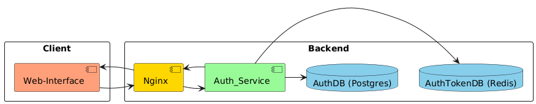
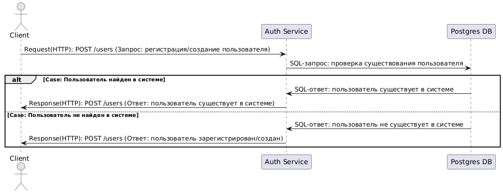
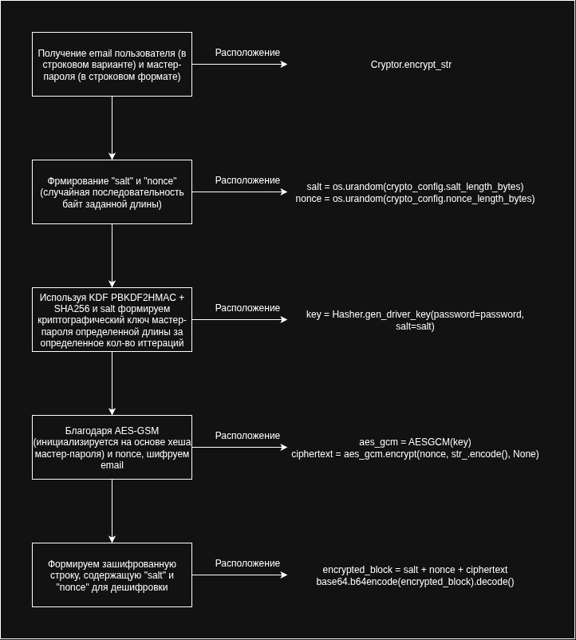
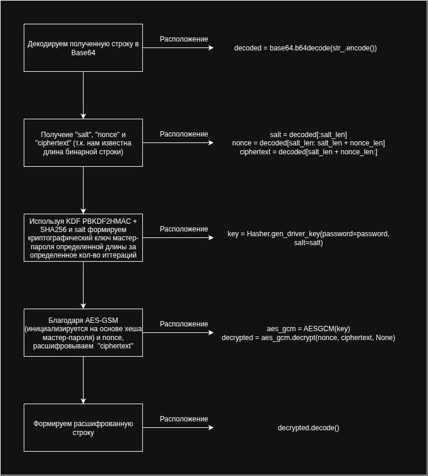
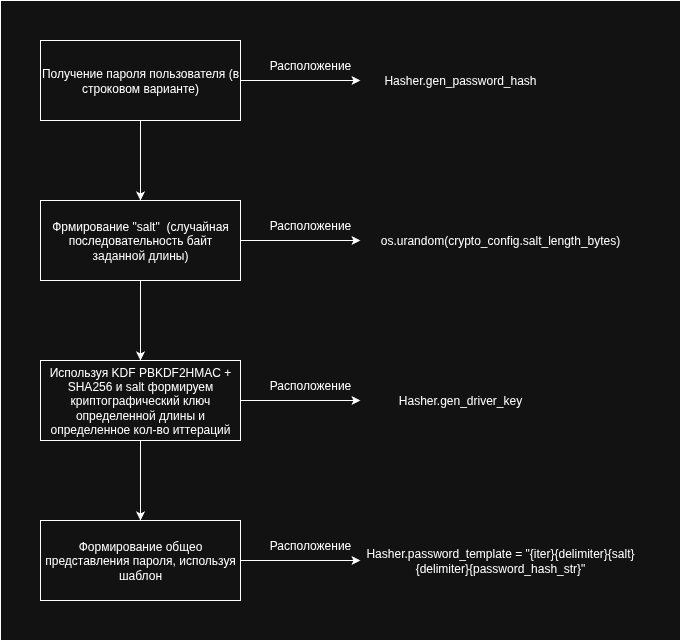

# Auth Service

* * *

### **Задача (Бизнес требование):**
Реализация сервиса авторизации и регистрации пользователей.
* * *

## Архитектура сервиса:

## Основные компоненты сервиса + зоны ответственности:
### Client:
**Web-Interface**:
- UI-интерфейс кинотеатра;

### Backend:
**Nginx**:
- Веб-сервер;
- Балансировка нагрузки;
- Документация: https://nginx.org/;

**AuthService**:
- Авторизация пользователей;
- Вход в систему и выход из системы пользователем;
- Работа с jwt-токенами пользователей;
- Работа с ролями пользователей (IdMS);
- Используемые решения:
- - FastAPI: https://fastapi.tiangolo.com/;
- - Pydantic: https://docs.pydantic.dev/latest/;
- - Система авторизации JWT (JSON Web Token): https://datatracker.ietf.org/doc/html/rfc7519

**AuthDB**:
- Реляционная база данных для хранения основной информации по пользователям;
- Используемые решения:
- - PostgreSQL: https://www.postgresql.org/;

**AuthTokenDB**:
- NoSQL база данных, хранящая токены пользователей в формате "ключ-значение";
- Используемые решения:
- - Redis: https://redis.io/;

## Требования:
### Функциональные:
- Регистрация пользователя;
- Вход в систему пользователем;
- Выход из системы пользователем;

### Нефункциональные:
- **Availability**(доступность системы):
- - SLA(Service Level Agreement): 99%;
- **Reliability**(надежность системы): >= 85%;
- **Fault Tolerance**(отказоустойчивость системы):
- - Механизмы быстрого восстановления после сбоев;
- - "Умная деградация" системы в случае сбоя одного из компонентов (RedisDB, PostgresDB);

## Архитектурное представление API:
### Регистрация/создание пользователя:

## Безопасность данных:
### **Шифрование данных**:
1. Используется симметричный алгоритм шифрования **AES-GSM** (Advanced Encryption Standard - Galois/Counter Mode):
- **AES** - обеспечивает симметричное шифрование.
- **GSM** - обеспечивает аутентификацию.
- Области применения:
- - Шифрование чувствительных данных: email, тел. номер и т.п.

**Пример алгоритма шифрования email пользователя:**

**Пример алгоритма расшифровывания email пользователя:**

### **Хеширование данных**:
1. В качестве **функции формирования ключа**(KDF) выступает **PBKDF2+SHA256** (согласно [NIST](https://nvlpubs.nist.gov/nistpubs/Legacy/SP/nistspecialpublication800-132.pdf)):
- Применяемые решения:
- - cryptography: https://cryptography.io/en/latest/;
- Области применения:
- - Для формирования криптографически стойкого ключ-пароля пользователя;
- - Для формирования криптографически стойкого ключа мастер паролей, участвующих в шифровании/дешифровании (например, мастер пароль для шифрования/дешифрования email-почты определенной длины);

2. Для формирования hash-строк с возможностью проверки/сравнения используется HMAC:
- Применяемые решения:
- - HMAC: https://docs.python.org/3/library/hmac.html;
- Области применения:
- - Проверка подлинности и целостности hash-строк;
- - Сравнение hash-строк для поиска по чувствительным данным (например, поиск пользователя по email);

- **Пример алгоритма формирования хэш-пароля пользователя:**

